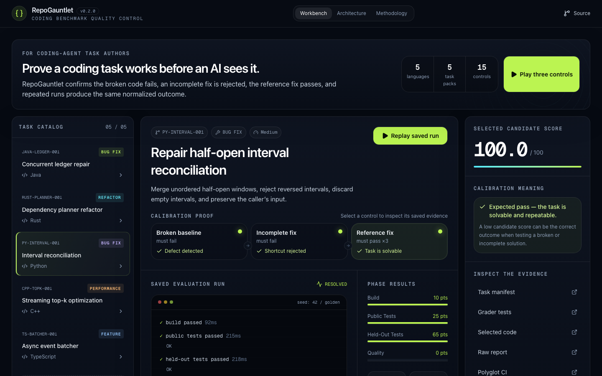
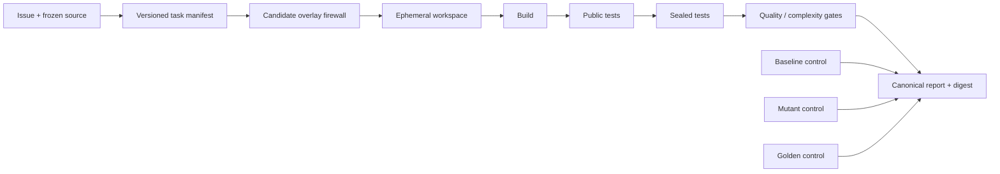

# RepoGauntlet

> Turn a bug report into a trustworthy coding-agent reward: frozen source, guarded overlay, hidden checks, golden calibration, deterministic verdict.

[](https://github.com/shi1720/repo-gauntlet/actions/workflows/ci.yml)
[](./core/repogauntlet)
[](./tasks)
[](./LICENSE)

RepoGauntlet is a local-first workbench for authoring and calibrating reproducible software-engineering environments for AI agents. It does not grade a patch with one opaque pass/fail. It proves that the original defect is observable, plausible incomplete fixes are rejected, the reference solution passes, and repeated verdicts normalize to the same digest.

**[Open the interactive evaluation workbench](https://shi1720.github.io/repo-gauntlet/)**

[](https://shi1720.github.io/repo-gauntlet/)

## 30-second demo

```bash
git clone https://github.com/shi1720/repo-gauntlet.git
cd repo-gauntlet
make demo
```

Expected result:

```text
RepoGauntlet demo: PY-INTERVAL-001 scored 100.0/100 (RESOLVED)
reproducibility digest: <stable sha256>
```

No API keys, accounts, network calls, or Docker daemon are needed for the Python quickstart. `make doctor` reports which optional polyglot toolchains are installed; CI calibrates all five.

## Why this exists

A coding benchmark is only useful when its reward is trustworthy. Tests can be too narrow, regressions can hide outside the reported issue, performance gates can be noisy, and infrastructure failures can look like candidate failures. RepoGauntlet makes those failure modes explicit.

Each task pack contains:

- a frozen source snapshot and behavior-focused issue;
- an allowlist of candidate-editable files;
- public and hidden grader suites;
- baseline, plausible-mutant, and golden control candidates;
- exact build/test commands, resource policy, seed, and scoring weights;
- a canonical JSON report whose digest excludes volatile timings.

## Architecture



The Python control plane validates manifests, rejects unsafe overlays, creates a fresh workspace, invokes commands as argv with `shell=False`, normalizes the environment, classifies each phase, and emits an auditable report. The hosted TypeScript workbench replays committed reports without pretending to run untrusted code in a browser.

Test phases must return a trusted grader-completion marker; a candidate that exits successfully before the suite completes is still classified as failed. Distinct quality commands may earn points, while task packs whose quality command only repeats compilation assign it zero weight.

Read the [architecture deep dive](./docs/architecture.md), [task-authoring guide](./docs/task-authoring.md), and [threat model](./docs/threat-model.md).

## Skill-to-evidence map

| Requirement | Executable evidence | Control that proves it |
|---|---|---|
| Python 3 + algorithms | [Half-open interval union](./tasks/python/interval-ledger) | 1,000 seeded property cases |
| Java + bug fixing | [Concurrent ledger](./tasks/java/concurrent-ledger) | multi-threaded lost-update stress |
| Rust + refactoring | [Dependency planner](./tasks/rust/dependency-planner) | 50,000-node non-recursive graph |
| C++ + optimization | [Streaming top-k](./tasks/cpp/streaming-topk) | deterministic comparison budget |
| TypeScript + features | [Re-entrant event batcher](./tasks/typescript/event-batcher) | exactly-once failure/retry tests |
| System design | [Runner + schemas](./core/repogauntlet) | manifest, security, and digest tests |

## Task calibration contract

```text
baseline  → must fail     proves the defect exists
mutant    → must fail     proves the tests reject a shortcut
golden    → must resolve  proves the task is solvable
repeat    → same digest   proves the reward is reproducible
```

Run one environment:

```bash
PYTHONPATH=core python3 -m repogauntlet.cli run PY-INTERVAL-001 --candidate baseline
PYTHONPATH=core python3 -m repogauntlet.cli run PY-INTERVAL-001 --candidate golden
```

Calibrate every task for which the toolchain is installed:

```bash
make doctor
PYTHONPATH=core python3 -m repogauntlet.cli validate CPP-TOPK-001
PYTHONPATH=core python3 -m repogauntlet.cli validate TS-BATCHER-001
```

## Failure taxonomy

Reports separate `PATCH_REJECTED`, `BUILD_FAILED`, `TEST_FAILED`, `QUALITY_FAILED`, `TIMEOUT`, `INFRA_ERROR`, and `RESOLVED`. Candidate code is never run through a shell string. Overlay paths are allowlisted; absolute paths, parent traversal, symlinks, oversized files, and protected grader/golden paths are rejected before execution.

The local runner is deliberately documented as a **trusted authoring and CI calibration path**, not a hardened multi-tenant sandbox. Untrusted submissions require the container boundary and controls described in [the threat model](./docs/threat-model.md). Docker is not a VM.

## Validation matrix

GitHub Actions runs independent jobs so a failure remains attributable:

- Python core unit, negative-path, and canonical-digest tests;
- baseline ↔ mutant ↔ golden calibration for Python, Java, Rust, C++, and TypeScript;
- TypeScript lint and production build;
- schema and repository hygiene checks;
- committed-report drift checks against fresh evaluations.

Locally verified on the reference checkout: Python core (9 tests), Python calibration, C++ calibration, TypeScript calibration, schema validation, frontend lint, and production build. Java and Rust are verified by their isolated CI jobs because those compilers are intentionally not assumed by the quickstart.

## Repository map

```text
core/repogauntlet/     Python manifest, firewall, runner, report, CLI
tasks/               Five real polyglot task environments
schemas/             Versioned task and report JSON Schemas
reports/             Machine-readable committed demo report
components/ + app/   Interactive TypeScript evaluation workbench
docs/                Architecture, authoring, security, ADRs
tests/               Core contract and failure-path tests
```

## Project pitch

RepoGauntlet is the missing quality gate between “this issue looks interesting” and “this environment emits a useful reinforcement-learning reward.” It gives task authors an executable preflight, gives reviewers an audit trail, and gives agent teams stable cross-language environments that distinguish candidate mistakes from benchmark mistakes.

## Status

`v0.1.2` includes five reference environments and a static report workbench. Committed reports cover the three toolchains available on the reference development host; CI calibrates all five. The next engineering milestone is a rootless OCI execution adapter with image-digest verification; that work is intentionally not represented as finished security isolation in this release.

Contributions are welcome. Start with [CONTRIBUTING.md](./CONTRIBUTING.md). Security reports follow [SECURITY.md](./SECURITY.md).
