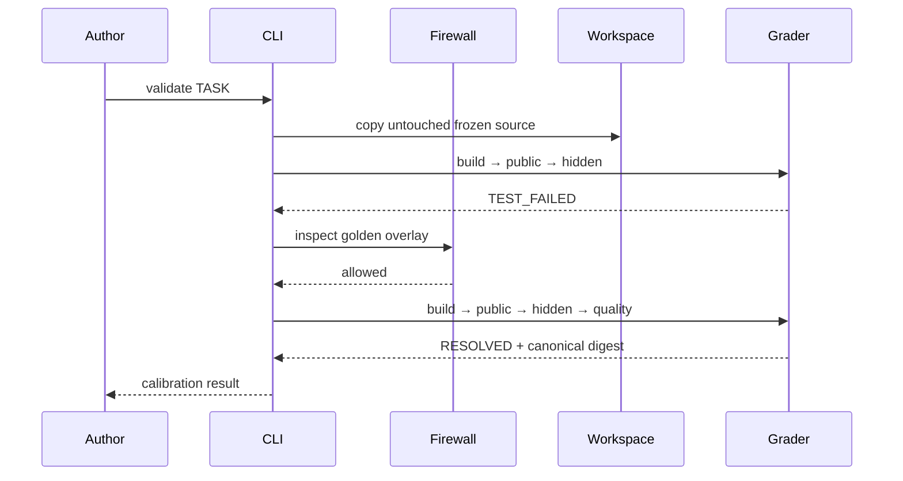

# Architecture

## Design goals

RepoGauntlet optimizes for four properties: a task is reproducible, a verdict is explainable, a broken evaluator is distinguishable from a broken candidate, and language support is data-driven rather than hard-coded into the control plane.

## Components

### Catalog and manifest

`catalog.py` discovers `tasks/<language>/<slug>/task.json`. `TaskManifest` validates the version, argv commands, candidate allowlist, network policy, resource bounds, and a scoring total of exactly 100. Unknown schema versions fail closed.

### Candidate overlay firewall

The overlay is a directory containing only files an agent may modify. Before copying anything, RepoGauntlet rejects absolute/parent paths, symlinks, grader or golden paths, missing required files, individual files above 512 KiB, and overlays above 2 MiB.

### Ephemeral evaluator

The authoring runner copies the frozen source to a fresh temporary directory for every phase, applies the validated overlay, injects the grader, and invokes each command with `shell=False`. It keeps a narrow environment allowlist and fixes the seed, locale, timezone, hash seed, color behavior, and `SOURCE_DATE_EPOCH`. Test phases rebuild in their own workspaces so a public check cannot mutate the hidden check's starting state.

### Grader phases

Build, public tests, hidden tests, and quality checks each emit duration, exit code, bounded output, status, and points. A build failure prevents misleading test output. Timeouts and missing toolchains receive their own classifications.

### Canonical report

The report digest includes task, candidate, verdict, score, seed, and stable phase outcomes. It excludes host strings, timestamps, raw output, and timings so repeated behavior produces the same digest across machines.

## Evaluation sequence

## Extension boundary

Language support lives in task argv, not an `if language == ...` runner. A new language is eligible when its pinned toolchain can build offline and its grader reports success through a process exit code. This keeps the orchestration contract small and makes task packs independently reviewable.

## Tradeoffs

- JSON manifests are less friendly for comments than YAML, but remove a parser dependency from the credential-free quickstart and have an unambiguous schema.
- Full candidate files are used as controls instead of pre-generated patches. This makes calibration readable and avoids platform-specific patch behavior. Production ingestion can convert a reviewed patch to the same overlay.
- Operation counts are the C++ performance acceptance gate; wall-clock duration remains diagnostic. This is less representative of absolute throughput but far more stable across CI hardware.
- The browser workbench replays schema-validated committed reports. Digests detect drift; they are not signatures. The static deployment does not claim to execute native code.
